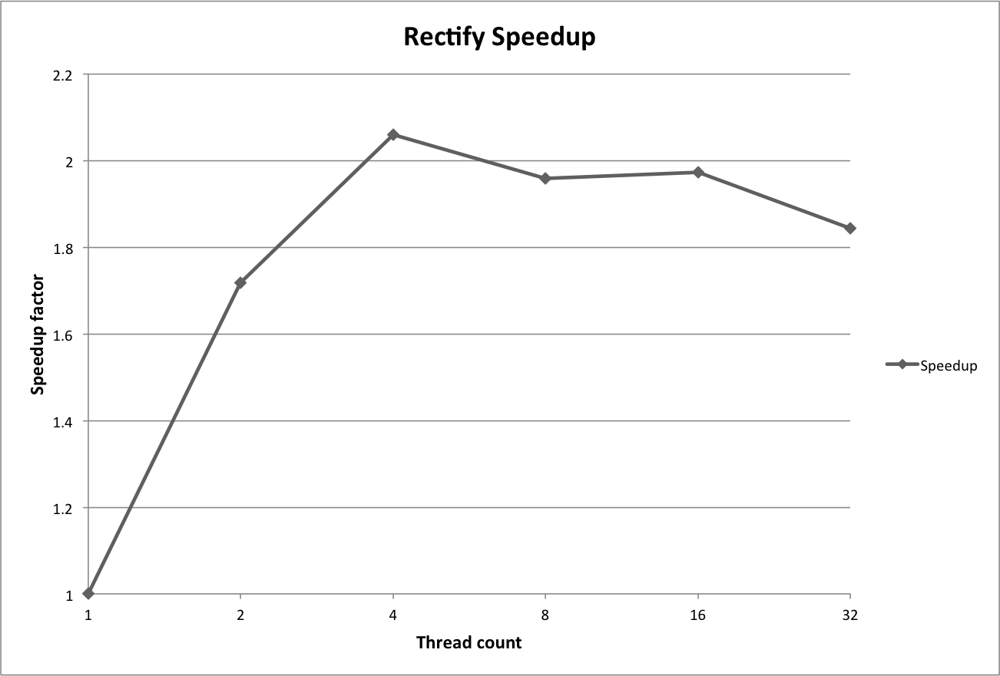
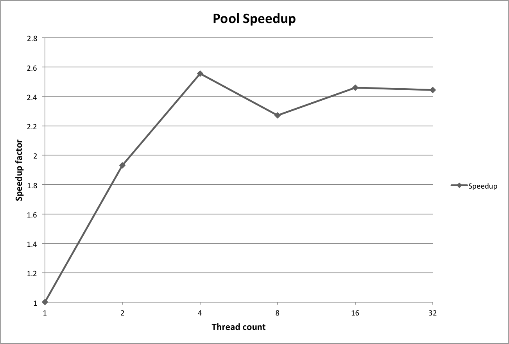
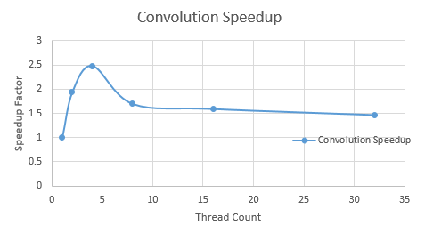

# Report

Aleksi Sapon-Cousineau - 260581670  
Samuel Cauchon - 260587509

## 1. Rectification

Our rectification implementation was timed using the `mach_absolute_time` function. This was performed on a mid 2010 MacBook Pro, with a dual core Intel i7 at 2.66GHz. This CPU supports HyperThreading, which gives us 4 logical threads.

Only the image manipulation part was timed. The PNG loading and saving portions where omitted due to the high variation in disk access times. This better reflects the effects of parallelization on the program run time.

Parallelization was achieved using OpenMP, using `#pragma omp parallel for num_threads(threadCount)` on a `for` loop which performed rectification for each pixel.

|Thread count|Time (seconds)|
|------------|--------------|
|1           |0.01036       |
|2           |0.00603       |
|4           |0.00503       |
|8           |0.00529       |
|16          |0.00525       |
|32          |0.00562       |

There is an increase in speedup up to 4 threads, which corresponds to the number available on the CPU. The speedup between 2 and 4 is less significant than between 1 and 2, most likely because logical threads aren't as fast as physical ones and because of threading overhead.

Afterwards the speedup improvement starts to decrease. This is due to the increase in overhead, which comes from the thread management and scheduling across the smaller number of physical threads.

The speedup factor (relative to 1 thread) for each thread count.

The input image used for the rectification performance tests.

The output image from the rectification performance tests.

## 2. Pooling

Our pooling implementation was timed using the `mach_absolute_time` function. This was performed on a mid 2010 MacBook Pro, with a dual core Intel i7 at 2.66GHz. This CPU supports HyperThreading, which gives us 4 logical threads.

Only the image manipulation part was timed. The PNG loading and saving portions where omitted due to the high variation in disk access times. This better reflects the effects of parallelization on the program run time.

Parallelization was achieved using OpenMP, using `#pragma omp parallel for num_threads(threadCount)` on a `for` loop which performed pooling for each group of 4x4 pixels.

|Thread count|Time (seconds)|
|------------|--------------|
|1           |0.07011       |
|2           |0.03633       |
|4           |0.02744       |
|8           |0.03088       |
|16          |0.02850       |
|32          |0.02870       |

The speedup plot is very similar to that of the rectification results. The explanation for the curve is thus the same.

One difference though is that the speedup factors are higher across the board. This is probably due to the increased complexity of the operation, which benefits more from parallelization. The image used is also quite a bit bigger. Overall this means that the parallel part is longer, so the speedup is higher.

The speedup factor (relative to 1 thread) for each thread count.

The input image used for the pooling performance tests.

The output image from the pooling performance tests.

## 3. Convolution

Our convolution implementation was timed using the `mach_absolute_time` function. This was performed on school's server, with a 6 cores  Intel(R) Xeon(R) CPU E5-2640 0 at 2.50GHz. This CPU supports HyperThreading, which gives us 12 logical threads.

Only the image manipulation part was timed. The PNG loading and saving portions where omitted due to the high variation in disk access times. This better reflects the effects of parallelization on the program run time.

Parallelization was achieved using OpenMP, using `#pragma omp parallel for num_threads(threadCount)` on a `for` loop which performed the sum of the sub-matrices multiplied with the weighted matrix.

|Thread count|Time (seconds)|
|------------|--------------|
|1           |0.118832      |
|2           |0.0613414     |
|4           |0.080522      |
|8           |0.07016       |
|16          |0.07476       |
|32          |0.081016      |

The graph shows that there is a considerable improvement of the speedup from 1 thread to 4 threads. However, past 4 threads, the performance of the operation diminishes, and so does the speedup. Since this experiment was conducted on the school's server, we may have not been able to access to the all the 6 CPUs, which is why the performance drops at a lower thread count. Again, the heading added to each thread is another reason why the performance drops. Although the performance starts to drop past 4 threads, the magnitude of the speedup is bigger than the other transformations.

The speedup factor (relative to 1 thread) for each thread count.

The input image used for the convolution performance tests.

The output image from the convolution performance tests.
