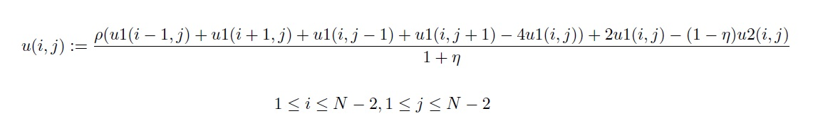

#Report
Aleksi Sapon-Cousineau - 260581670  
Samuel Cauchon - 260587509

## Scheme Used
In order to create a parallelizable program to process a 4 by 4 finite element grid (and then extend this to a 512 by 512 finite element grid), we needed to create a system of nodes where each node is assigned to a finite element. 
The way our programs works is the following. First, create a partition based on the number of processes. Once the partition is created, create a block for each process. These blocks contains all the data that a single process will be using in order to perform the simulation. Once a block is allocated memory to exist, we assign a “node” for each finite element in a block. It is important to note that in order to calculate edge cases for each block, a block also needs the information of all its surrounding nodes (the nodes above the block, the nodes to its left, the nodes to its right and the nodes below). Each node contains the information of a single finite element (its displacement in the current time step, in the previous time step and in the previous previous time step).
Once our system is done, we can calculate each node’s displacement by using the formula given to us:

 
After each iteration, the program checks for the middle node which is the one with coordinates (2, 2) for a 4 by 4 grid (or (256, 256) for a 512 by 512 grid). The current displacement is then printed. Once this is done, the program waits for all the processes to be done with their blocks. Once all the processes are done, the next iteration starts (if there are more). This step is important since the displacement of each node is calculated with respect to the surroundings previous displacement. If this step was not there, the program would have some serious synchronization problems (it would use information that was not updated by another process that has not finished its iteration).

##Expansion from a 4 by 4 to a 512 by 512
In a 4 by 4 grid, there are 16 elements. In this lab, 16 processes are used in order to run the program. This means that 16 blocks are created and each block contains one finite element and the information of its surrounding elements. Since one finite element is a node in the scheme used, then each block contains one node and all its surrounding nodes.

In a 512 by 512 grid, there are 262 144 elements. In this case, we cannot assign a block per finite element. This means that we will be using 16 blocks containing  262144/16= 16 384 elements each. However, the scheme works the same way. It updates all the nodes with respect to the surrounding nodes. 

##Discussion on the results
First of all, the results of our program are well within the expected uncertainty since our mean squared error is equal to 0.000000 if we compare the output array in output.h versuses the values of running the following command:

mpirun -np 16 ./grid_512_512 2000

To check if our result and the output example are equals, we simply redirect the printing to a file called outputProg.h by using th efollowing command:

mpirun -np 16 ./grid_512_512 2000 >> outputProg.h

We then modified the file to make it an array declaration. Then, we used the small program called checkOutput.c to see if they were equals. The program simply calculates the mean squared value of both arrays of 2000 size and output the value.

##Conclusion
From the result that we get, our program does indeed aatisfies the mean squared value of 0.00001 since our mean square value is equal to 0.00000. It was programmed using mpi and fully parallelized by splitting our grid into a partition of 16 blocks, each containing a set of nodes and surrounding nodes. Each process has a block and performs the calculations on the nodes it contains by using the given formula and initial conditions.

