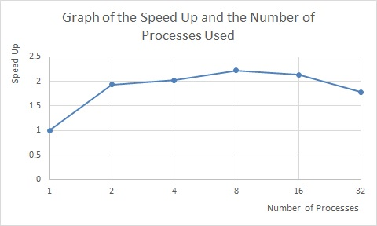

# Report
Aleksi Sapon-Cousineau - 260581670  
Samuel Cauchon - 260587509

## Scheme Used
In order to create a parallelize-able program to process a 4 by 4 finite element grid (and then extend this to a 512 by 512 finite element grid), we needed to create a system of nodes, where each node corresponds to a finite element.
The way our programs works is the following: first, we create a partition of blocks based on the number of processes. Then we create a block for each process. These blocks contain all the data that a single process will be needing in order to perform the simulation. Finally we allocate in the block one node for each finite element. It is important to note that in order to calculate edge cases for each block, we also need the information of all its surrounding nodes (the nodes above the block, the ones to its left, the ones to its right and the ones below). Each node contains the displacement at the current time step, at the previous time step, and at the previous-previous time step.

The simulation is done in iterations. Each iteration start with a barrier, to ensure that we only start when all processes are done with the initialization phase or the previous iteration. Next we do the block updates, which begins by sending the boundary nodes to the neighbouring blocks. This is done using a non-blocking send. Then we wait to receive the data from the neighbours, this time using a blocking receive. Only when communication is over can we apply the update equations. Finally, the block containing the middle node will print out its current value.

For the 4 by 4 grid, it is also necessary to perform two extra stages of communication during an iteration. This is because the edges and corners update using the neighbour values of the current iteration, not the previous. This means that we need to send data from current iteration to the edges to updated them. We also need to do this for corners, which depend on the edges, so this adds one more round of communication.

## Expansion from a 4 by 4 to a 512 by 512
In a 4 by 4 grid, there are 16 elements. In this lab, 16 processes are used in order to run the 4 by 4 case. This means that 16 blocks are created and each block contains only one finite element.

For the 512 by 512 grid we use the exact same program, the only difference is that blocks contain more than one node.

## Discussion on the results
First of all, the results of our program are well within the expected uncertainty, since our mean squared error is equal to `0.000000`. To check if our result and the output example were equal, we simply redirected the printing to a file called `outputProg.h` by using the following command:

    mpirun -n 16 ./grid_512_512 2000 >> outputProg.h

We then modified the file to make it an array declaration. After this, we used a small program (`checkOutput.c`) to calculate the mean squared error between our output and the reference `output.h`.

## Performance
Before starting, it is important to mention that this performance test was performed on a mid 2010 MacBook Pro, with a dual core Intel i7 at 2.66GHz. This CPU supports HyperThreading, which gives us 4 logical threads. We tested performance of the 512 by 512 grid with 2000 iterations, using the bash `time` command's real time output. The command is shown below.

    time mpirun -n <1,2,4,8,16 or 32> ./grid_512_512 2000

Our first guess was that the speed up of our program would be high due to the high parallelize-ability of our scheme, but would cap at 4 processes. We expected this because the parallelization gains should be limited by the hardware capability, and any more processes would just add overhead. The following graph shows the speedup of our program compared with the number of processes used.

|Thread count|Time (seconds)|Speed Up   |
|------------|--------------|-----------|
|1           |20.635        |1.0000     |
|2           |10.685        |1.9312     |
|4           |10.200        |2.0230     |
|8           |9.297         |2.2195     |
|16          |9.669         |2.1341     |
|32          |11.594        |1.7798     |

The speed up of our program goes as high as 2.22 for 8 processes used. We also notice that the speedup relation cap at 8 processes instead of 4. Since the values are very close, this might just be the result of some measurement error. We can also conclude that the overhead of adding more processes is significant, since we did not achieve a speedup much greater than 2, even if we have 4 logical cores available. Although this could also be due to the fact that hyper-threaded cores are not as fast at the physical ones in most cases, and so we the cap of our program is actually 2.

## Conclusion
From the results that we got, our program does indeed satisfies the mean squared value of `0.00001` since our mean square value is equal to `0.00000`. It was programmed using MPI and fully parallelized by splitting our grid into a partition of P blocks (where P is the number of processes used), each containing a set of nodes and surrounding nodes. Each process has a block and performs the calculations on the nodes it contains by using the given formula and initial conditions.
